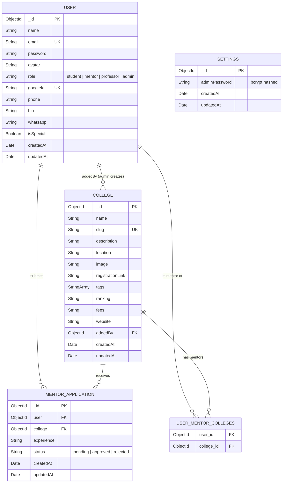

# ER Diagram — CampusConnect

## Overview

This Entity-Relationship diagram represents the MongoDB collections (tables) and their relationships in the CampusConnect database.

---

## ER Diagram

---

## Entity Descriptions

### USER
The central entity representing all platform users. The `role` field determines access level:

| Role        | Permissions                                              |
|-------------|----------------------------------------------------------|
| `student`   | Browse colleges, apply as mentor, view profiles          |
| `mentor`    | All student permissions + visible on college pages       |
| `professor` | Similar to mentor but designated as faculty              |
| `admin`     | Full CRUD on colleges, mentors, professors, settings     |

**Key Constraints:**
- `email` is unique and stored in lowercase
- `password` is bcrypt-hashed (12 salt rounds) via pre-save hook
- `googleId` is optional (only for OAuth users)
- `isSpecial` marks a mentor as featured on the homepage

### COLLEGE
Represents an educational institution listed on the platform.

**Key Constraints:**
- `slug` is unique, auto-generated from `name`
- `addedBy` references the admin user who created it
- `tags` is an array of strings for categorization (e.g., "Engineering", "Medical")

### MENTOR_APPLICATION
A join entity tracking the mentor application lifecycle.

**Key Constraints:**
- Unique compound index on `(user, college)` — prevents duplicate applications
- `status` transitions: `pending` → `approved` or `pending` → `rejected`
- On approval: user's role changes to `mentor`, college is added to `mentorColleges`
- On rejection: if no other approved apps exist, user role reverts to `student`

### USER_MENTOR_COLLEGES (Embedded Array)
This is not a separate MongoDB collection but an embedded array (`mentorColleges`) within the User document. It represents the many-to-many relationship between mentors and colleges.

**Key Behavior:**
- Populated when a mentor application is approved
- Removed when a college is deleted (`$pull` operation)

### SETTINGS
A singleton collection storing platform-wide configuration.

**Key Constraints:**
- Only one document exists in this collection
- `adminPassword` is bcrypt-hashed independently from User passwords
- Used for the admin-only password login flow

---

## Relationship Summary

| Relationship                          | Type          | Description                                      |
|---------------------------------------|---------------|--------------------------------------------------|
| User → MentorApplication              | One-to-Many   | A user can submit multiple mentor applications   |
| College → MentorApplication           | One-to-Many   | A college can receive multiple applications      |
| User ↔ College (via mentorColleges)   | Many-to-Many  | A mentor can be linked to multiple colleges      |
| User → College (via addedBy)          | One-to-Many   | An admin can create multiple colleges            |

---

## Indexes

| Collection           | Index                        | Type   | Purpose                          |
|----------------------|------------------------------|--------|----------------------------------|
| User                 | `email`                      | Unique | Prevent duplicate registrations  |
| College              | `slug`                       | Unique | Unique URL-friendly identifiers  |
| MentorApplication    | `{ user: 1, college: 1 }`   | Unique | Prevent duplicate applications   |

---

**Date**: 22 April 2026
