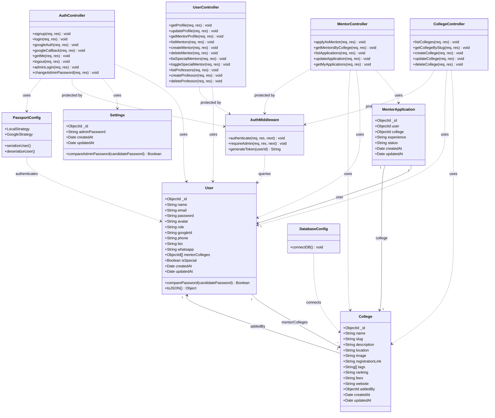

# Class Diagram — CampusConnect

## Overview

This diagram represents the major classes (Models, Controllers/Routes, Middleware, Config) and their relationships in the CampusConnect platform.

---

## Class Diagram

---

## Class Descriptions

### Models (Data Layer)

| Class               | Purpose                                              |
|---------------------|------------------------------------------------------|
| **User**            | Represents all users (student, mentor, professor, admin). Includes bcrypt password hashing and comparison methods. |
| **College**         | Represents a college entity with metadata. Auto-generates URL slug from name. |
| **MentorApplication** | Tracks mentor applications with status (pending/approved/rejected). Unique index on user+college. |
| **Settings**        | Stores platform-level settings like the admin password (hashed). |

### Controllers (Business Logic Layer)

| Class                | Purpose                                              |
|----------------------|------------------------------------------------------|
| **AuthController**   | Handles signup, login (local + Google), logout, admin auth, and password changes. |
| **CollegeController**| CRUD operations for colleges, search and filter functionality. |
| **MentorController** | Mentor application lifecycle: apply, list, approve, reject. |
| **UserController**   | Profile management, admin CRUD for mentors/professors, special mentor toggling. |

### Infrastructure

| Class               | Purpose                                              |
|---------------------|------------------------------------------------------|
| **AuthMiddleware**  | JWT verification, admin role checking, token generation. |
| **PassportConfig**  | Configures Local and Google OAuth strategies.        |
| **DatabaseConfig**  | MongoDB connection via Mongoose.                     |

---

## Design Patterns Used

| Pattern                  | Where Applied                                      |
|--------------------------|---------------------------------------------------|
| **MVC Architecture**     | Models → Controllers → Routes → Views (React)     |
| **Middleware Pattern**   | AuthMiddleware for authentication & authorization  |
| **Strategy Pattern**     | Passport.js strategies (Local, Google)             |
| **Repository Pattern**   | Mongoose models encapsulate all DB operations      |
| **Observer Pattern**     | Mongoose pre-save hooks for password hashing       |

---

**Date**: 22 April 2026
