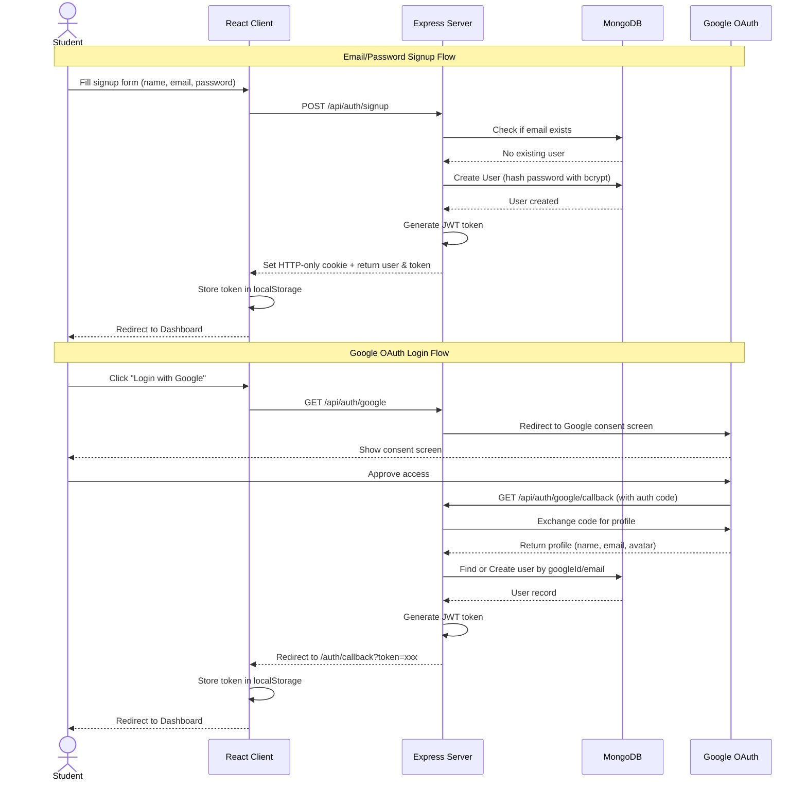
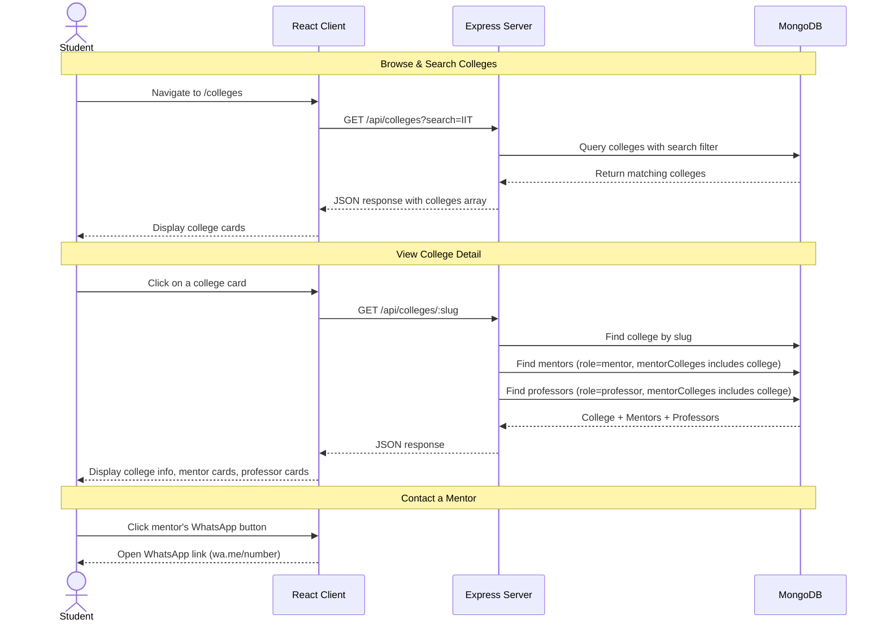
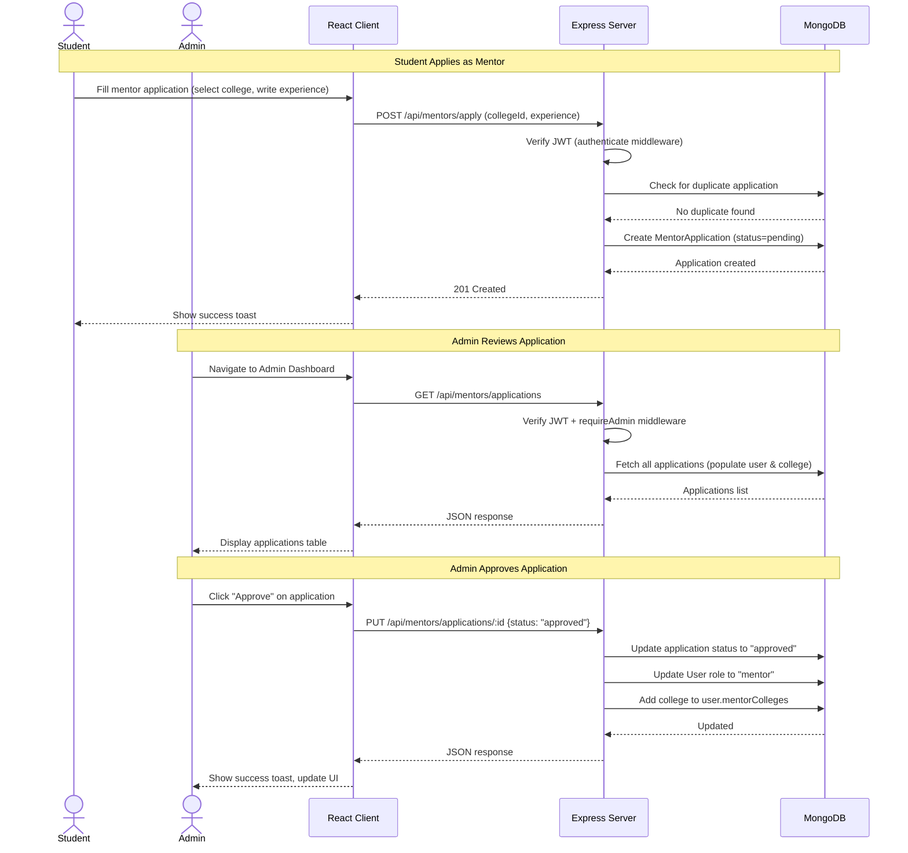
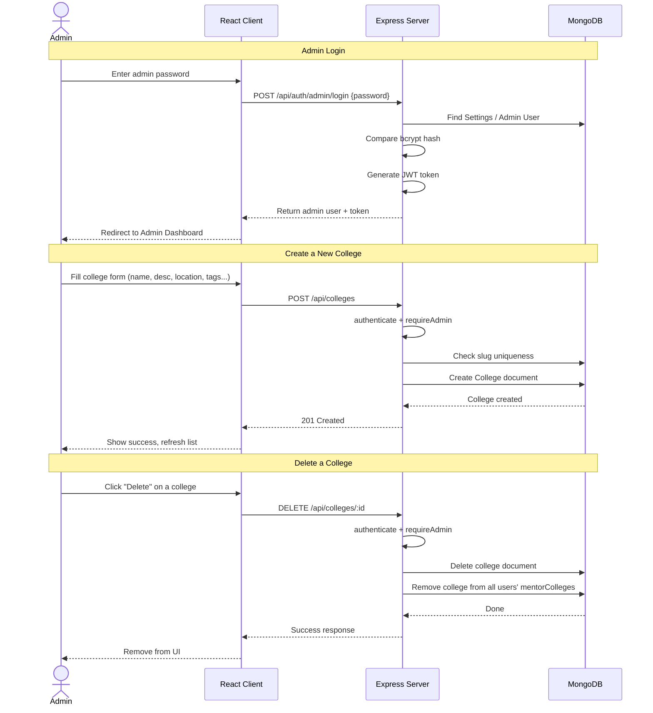

# Sequence Diagram — CampusConnect

## Overview

This document illustrates the end-to-end main flow of the platform: from user registration to discovering a college and connecting with a mentor.

---

## Flow 1: User Registration & Login

---

## Flow 2: College Discovery & Mentor Connection

---

## Flow 3: Mentor Application & Approval

---

## Flow 4: Admin College Management

---

**Date**: 22 April 2026
