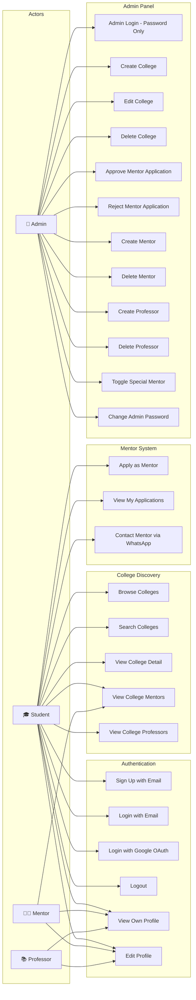

# Use Case Diagram — CampusConnect

## Overview

This diagram shows the interactions between the four actors (Student, Mentor, Professor, Admin) and the system's major use cases.

---

---

## Use Case Descriptions

| # | Use Case                    | Actor(s)       | Description                                                  |
|---|-----------------------------|----------------|--------------------------------------------------------------|
| 1 | Sign Up with Email          | Student        | Register a new account with name, email, and password        |
| 2 | Login with Email             | Student        | Authenticate using email and password                        |
| 3 | Login with Google OAuth      | Student        | Authenticate using Google account                            |
| 4 | Logout                       | All            | Clear session and JWT cookie                                 |
| 5 | View Own Profile             | All            | View personal profile details                                |
| 6 | Edit Profile                 | All            | Update name, bio, phone, WhatsApp, avatar                    |
| 7 | Browse Colleges              | Student        | View list of all available colleges                          |
| 8 | Search Colleges              | Student        | Filter colleges by name, location, or tags                   |
| 9 | View College Detail          | Student        | View full college information with mentors and professors    |
| 10| View College Mentors         | Student        | See approved mentors for a specific college                  |
| 11| View College Professors      | Student        | See professors linked to a specific college                  |
| 12| Apply as Mentor              | Student        | Submit application to become a mentor for a college          |
| 13| View My Applications         | Student/Mentor | Check status of submitted mentor applications                |
| 14| Contact Mentor via WhatsApp  | Student        | Reach out to a mentor via their WhatsApp number              |
| 15| Admin Login                  | Admin          | Login with admin-only password                               |
| 16| Create College               | Admin          | Add a new college to the platform                            |
| 17| Edit College                 | Admin          | Update college details                                       |
| 18| Delete College               | Admin          | Remove a college from the platform                           |
| 19| Approve Mentor Application   | Admin          | Accept a student's mentor application                        |
| 20| Reject Mentor Application    | Admin          | Decline a student's mentor application                       |
| 21| Create Mentor                | Admin          | Directly add a mentor without application                    |
| 22| Delete Mentor                | Admin          | Remove a mentor from the platform                            |
| 23| Create Professor             | Admin          | Add a professor linked to colleges                           |
| 24| Delete Professor             | Admin          | Remove a professor from the platform                         |
| 25| Toggle Special Mentor        | Admin          | Mark/unmark a mentor as featured on homepage                 |
| 26| Change Admin Password        | Admin          | Update the admin login password                              |

---

**Date**: 22 April 2026
